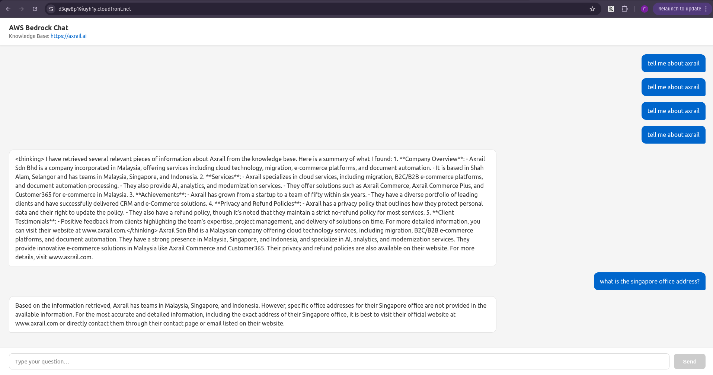
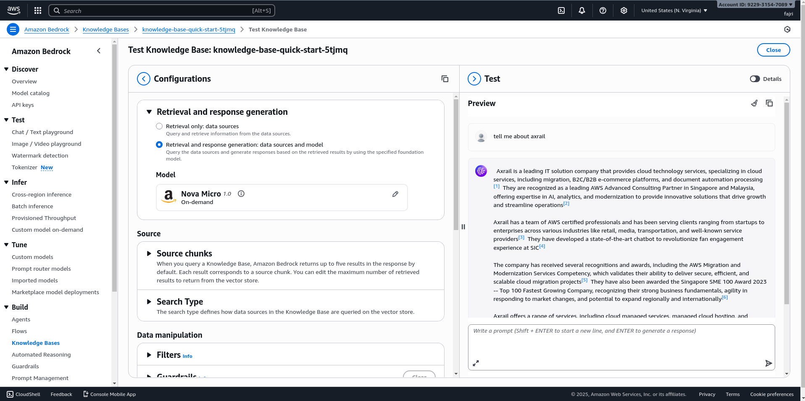
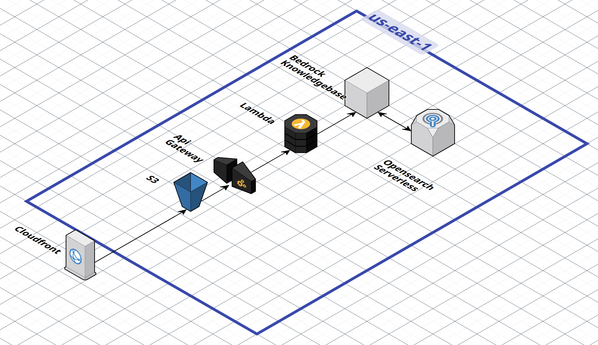

# Bedrock Chat Application

A minimal chat interface powered by AWS Bedrock Knowledge Base, built with FastAPI and vanilla JavaScript.



> Click here to download the screencast: [Production Demo](docs/prod_demo.mp4)

## Quick Start

### Production Deployment

1. **Connect to AWS via CLI**

   Option A - Configure default profile:
   ```bash
   aws configure
   ```

   Option B - Use named profile:
   ```bash
   aws configure --profile your-profile-name
   export AWS_PROFILE=your-profile-name
   ```

2. **Test AWS connection and prepare environment**
   ```bash
   make prod-preparation
   ```

3. **Deploy Bedrock Knowledge Base stack**
   ```bash
   cd infra/bedrock
   terraform init
   terraform apply --auto-approve
   ```

   Wait approximately 5 minutes for the stack to complete.

4. **Sync the Knowledge Base data source**

   Open AWS Console and manually sync the data source:
   https://us-east-1.console.aws.amazon.com/bedrock/home?region=us-east-1#/knowledge-bases

   Wait a few minutes for the sync to complete.

   Optional: Test the knowledge base in the AWS Console dashboard.

   

5. **Deploy Backend stack**
   ```bash
   cd ../backend
   terraform init
   terraform apply --auto-approve
   ```

   Test the API with curl (use the API Gateway URL from terraform output):
   ```bash
   curl -X POST "https://YOUR_API_ID.execute-api.us-east-1.amazonaws.com/api/chat" \
     -H "Content-Type: application/json" \
     -d '{"message": "what do you know about axrail?"}'
   ```

6. **Deploy Frontend stack**
   ```bash
   cd ../frontend
   terraform init
   terraform apply --auto-approve
   ```

   Wait approximately 5 minutes for CloudFront to be ready, then deploy the frontend files:
   ```bash
   cd ../..
   make prod-frontend-deploy
   ```

   Open the CloudFront domain URL from the terraform output.

7. **Destroy infrastructure (when needed)**

   Run `terraform destroy --auto-approve` in each directory (frontend, backend, bedrock).

   **Important:** Make sure to delete all S3 objects and versions before destroying.

8. If you encounter error: unexpected state 'DELETE_UNSUCCESSFUL', during destroying the bedrock stack

   - Change the Data Source, go to: https://us-east-1.console.aws.amazon.com/bedrock/home?region=us-east-1#/knowledge-bases/
   - Choose the Knowledge Base: bedrock-demo-kb
   - Edit Data Source: bedrock-demo-web-crawler
   - Click Advance Settings
   - Change Data Deletion policy to RETAIN, then submit
   - Run the terraform destroy again

### Local Development

Follow the steps above until you are deployed the Bedrock successfully, and tested the Bedrock in the AWS Console, then follow the steps below to test the Bedrock in a local environment via Docker.

1. Copy environment variables:
   ```bash
   cp .env.example .env
   ```

2. Configure your AWS credentials and Knowledge Base ID in `.env`

3. Start the application:
   ```bash
   make up
   # or
   docker-compose up -d
   ```

4. Access the application:
   - Frontend: http://localhost:8080
   - Backend API: http://localhost:8000
   - API Docs: http://localhost:8000/docs


## Architecture



> For this demo, region us-east-1 is used because it has native support for Amazon Nova model and to avoid subscription to other models.

**Frontend:**
- HTML5, CSS3, Vanilla JavaScript
- LocalStorage for persistence

**Backend:**
- Python 3.12+
- FastAPI
- Strands Agents (AWS Bedrock integration)
- Boto3

**Infrastructure:**
- Docker & Docker Compose (local)
- AWS Lambda + API Gateway (backend)
- S3 + CloudFront (frontend)
- Terraform (AWS infrastructure)
- Bedrock Knowledge Base

### Explanation

1. **Bedrock - Knowledgebase**

   Bedrock [Knowledge Base](https://docs.aws.amazon.com/bedrock/latest/userguide/kb-how-it-works.html) currently have a preview feature to crawl the data automatically. It is not 100% bullet proof, sometimes the website owner could block the crawler. And there is robots.txt file to prevent the crawler.

   The best condition maybe to combine multiple Bedrock [Data Source](https://docs.aws.amazon.com/bedrock/latest/userguide/kb-how-data.html), my suggestion is using S3 and Crawler.

   S3 can enrich the data when the crawler blocked by the website owner. Markdown with metadata json is the best format to store the data on S3.

2. **Lambda + API Gateway**

   Lambda is the best choice to host the FastAPI backend. It is scalable and cost-effective.

   API Gateway is the best choice to route the request to the Lambda function. It is scalable and cost-effective since it is serverless.

   In some cases, this combination is more expensive than using an EC2 instance, especially the API Gateway. And lambda has a limit on the request size and limit to the timeout.

   To cover this limitation, one solution is to combine with [Bedrock Prompt Caching](https://docs.aws.amazon.com/bedrock/latest/userguide/prompt-caching.html).

3. **FastAPI**

   FastAPI is the best choice to host the backend. It is one of the best Python frameworks for API development.

   Using [Mangum](https://mangum.fastapiexpert.com/), FastAPI can be deployed to AWS Lambda and API Gateway.

4. **Strands Agents**

   [Strands Agents](https://strandsagents.com/latest/documentation/docs/user-guide/concepts/model-providers/amazon-bedrock/?h=bedrock#basic-usage) is a simple-to-use, code-first framework for building agents, and it has integration with AWS Bedrock.

5. **S3 + CloudFront**

   S3 is the best choice to store the static files. It is scalable and cost-effective.

   CloudFront used to serve the static files from the S3 bucket. Cloudfront can cache the static files and serve them from the edge locations.
